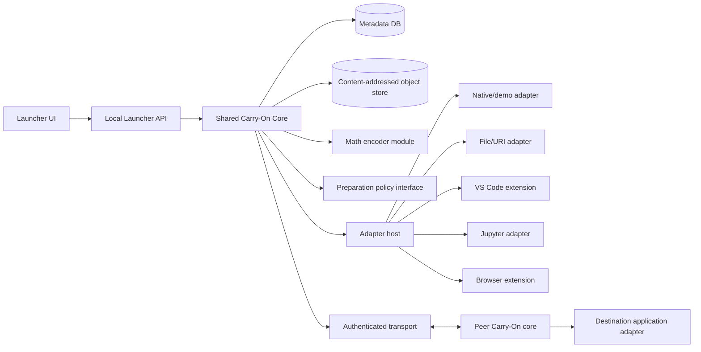
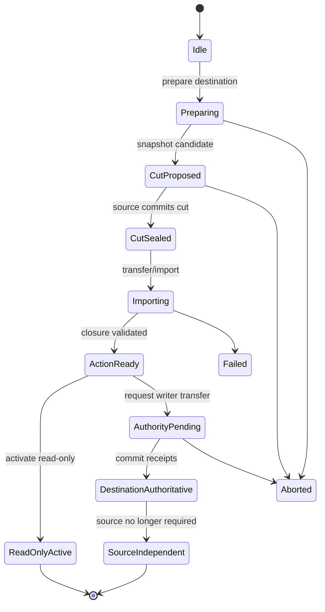

# Carry-On Cross-Platform Launcher and Continuation Engine

## Mathematical foundation, application requirements, platform APIs, protocol, security, and validation specification

**Document version:** 0.1

**Date:** October 2, 2026

**Status:** Engineering and research specification; not an implementation-complete claim

**Primary mathematical source:** [`main.tex`](main.tex)

**Related systems source:** [`prism-uploads/carry-on-research.md`](prism-uploads/carry-on-research.md)

**Existing local prototype:** [`prototype/fresh/README.md`](prototype/fresh/README.md)

**Existing iOS capability pilot:** [`prototype/ios-f3-i3/protocol.md`](prototype/ios-f3-i3/protocol.md)

---

## 1. Purpose

This document specifies a complete target architecture for a cooperative, cross-platform launcher and continuation engine named **Carry-On**. The system is intended to let a user begin supported work on one device and continue a declared action on another device without requiring every optional object, cache, or derived result to arrive first.

The document serves five purposes:

1. translate the block-sum encoding theorem into a precise, limited engine component;
2. define the broader application-state and handoff model required by a real product;
3. define supported operating systems, external-application integration levels, APIs, storage, transport, security, and user experience;
4. establish testable requirements for calling the result a working cross-platform engine;
5. separate mathematical claims, implemented evidence, planned engineering, and optional future work.

The theorem in `main.tex` is a rigorous result about progressive fixed-length encodings and endpoint Hamming distance. It is **not**, by itself, a theorem about process migration, arbitrary application continuation, network latency, scheduling, operating-system APIs, or cross-platform compatibility. This specification therefore uses the theorem as one formal component while defining the missing engineering layers explicitly.

---

## 2. Normative language and claim labels

The words **MUST**, **MUST NOT**, **REQUIRED**, **SHOULD**, **SHOULD NOT**, and **MAY** are used in the sense of RFC 2119 and RFC 8174 when written in uppercase.

Every feature or result SHALL be labeled with one of the following states:

| Label | Meaning |
|---|---|
| **PROVED** | Established mathematically under explicitly listed assumptions. |
| **IMPLEMENTED** | Present in source code and covered by automated tests. |
| **OBSERVED** | Measured on named physical hardware under a frozen protocol. |
| **TARGET** | Required by this specification but not yet demonstrated. |
| **OPTIONAL** | Useful but not required for the initial complete engine. |
| **RESEARCH** | An experiment, policy, or hypothesis whose benefit is not assumed. |
| **UNSUPPORTED** | Explicitly outside the product contract. |

No launcher screenshot, source-code volume, simulator run, or local-process test may be described as physical cross-device evidence. No platform may be listed as supported until its acceptance matrix in Section 30 passes on at least one physical device or machine of each claimed architecture.

---

## 3. Executive architecture decisions

The target system SHALL use the following architecture unless a later design record replaces a decision with evidence:

1. **Cooperative continuation, not arbitrary process migration.** An application is supported only through files, standard activation mechanisms, or an explicit adapter/plugin that exports typed state and actions.
2. **Shared native core.** A memory-safe portable core SHALL own protocol state, object/version validation, persistence, chunk transfer, cryptography, and the optional theorem-derived encoder.
3. **Thin platform shells.** Each operating system SHALL have a native integration layer for activation, permissions, background execution, secure storage, and packaging.
4. **Out-of-process desktop adapters.** Desktop external-app adapters SHOULD run outside the launcher process through authenticated local IPC. A crashing adapter MUST NOT corrupt the core database.
5. **Compiled-in or extension-based mobile adapters.** iOS/iPadOS adapters MUST be compiled into the app, exposed through approved app extensions, App Intents, documents, or URLs. Android adapters MAY also use bound services or exported activities with signature-level permissions.
6. **Versioned typed objects.** Application state SHALL be represented as authoritative or reconstructible objects with schemas, content hashes, generations, provenance, and dependency relationships.
7. **Explicit action contracts.** The destination becomes useful by executing a declared action against a validated dependency closure, not merely by displaying a generic “connected” state.
8. **No remote code execution from state.** Network messages and transferred manifests MUST NOT select arbitrary executable code, scripts, dynamic libraries, class names, or shell commands.
9. **Content-addressed transport.** Immutable object payloads SHALL be identified by cryptographic digest and transferred in independently verifiable chunks.
10. **Transactional handoff.** Authority transfer, source independence, and destination activation SHALL be explicit states with abort and recovery paths.
11. **Production cryptography.** The HMAC-only laboratory transport in the existing iOS pilot SHALL NOT be treated as the production security model. Production transport MUST use authenticated TLS 1.3 with device identity established during pairing.
12. **Portable UI target.** A shared Flutter UI is the preferred target for the launcher surface, while native Swift, Kotlin, and Windows/macOS/Linux bridge code handles operating-system-specific capabilities. A fully native UI on each platform remains compatible with the core architecture.
13. **Evidence-first claims.** The engine SHALL log correctness, versions, bytes, CPU, memory, action latency, source-dependence, and failures. Performance claims require frozen comparisons against ordinary save/reopen and demand loading.

---

## 4. Product definition

### 4.1 Product statement

Carry-On is a launcher and continuation coordinator that:

1. enrolls a user's devices;
2. discovers supported applications and their declared capabilities;
3. records a versioned logical session;
4. prepares bounded subsets or derived forms of state on another device;
5. seals a handoff cut;
6. validates sufficient state for a selected destination action;
7. opens the destination application at a supported continuation point;
8. reports whether the source remains required;
9. continues background synchronization under explicit budgets; and
10. preserves an auditable event and correctness record.

### 4.2 Intended users

- researchers moving notebooks, graphs, images, and derived artifacts between devices;
- students continuing a structured project between desktop and mobile devices;
- developers using cooperative editor or notebook extensions;
- demonstrations in which the mathematical encoder and the practical continuation engine are shown separately but coherently.

### 4.3 Core use cases

1. **File continuation:** transfer or locate a document, launch the receiving application, and reopen a declared document/position.
2. **Structured session continuation:** restore a workspace containing multiple authoritative files plus reconstructible indexes, previews, graphs, or image products.
3. **Action-first continuation:** prepare sufficient state for a specific action such as route computation, region rendering, notebook inspection, or document navigation.
4. **Progressive inspection:** expose aggregate state at early checkpoints and full state later.
5. **Source-off validation:** after a committed read-only handoff, prove that the destination can perform declared actions after the source service has terminated.
6. **Research comparison:** execute identical application actions under direct transfer, save/reopen, demand loading, and candidate preparation policies.

### 4.4 Non-goals

The initial complete engine SHALL NOT claim to provide:

- arbitrary process memory migration;
- kernel thread, socket, GPU context, or device-driver migration;
- transparent continuation of applications that expose no files, URLs, plugin API, intent, automation API, or adapter;
- transfer of DRM-protected content or secrets from another app's private container;
- preservation of arbitrary authenticated browser sessions, cookies, passwords, or payment state;
- bit-identical floating-point behavior across different hardware and libraries unless a workload explicitly establishes that property;
- universal latency improvement;
- a theorem about probes, runtime, network bytes, CPU usage, or total writes derived from the endpoint-Hamming theorem;
- background execution that violates iOS, Android, Windows, macOS, or application-store policies;
- cloud service availability as a prerequisite for local-LAN continuation;
- execution of code received from an untrusted peer.

---

## 5. Mathematical core

### 5.1 Source state

The theorem-backed encoder operates on a source vector

\[
x=(x_1,\ldots,x_n)\in A^n,
\]

where `A` is a nontrivial finite abelian group written additively.

Examples suitable for an implementation include:

- bits under XOR: `A = Z/2Z`;
- bounded counters under addition modulo `k`: `A = Z/kZ`;
- fixed-width vectors whose entries are elements of a finite product group;
- adapter-defined identifiers mapped to a finite group only when the mapping is exact and reversible for the declared source state.

Arbitrary UTF-8 text, JSON objects, files of varying length, floating-point arrays, and operating-system processes are not automatically elements of this model. They require an explicit fixed-length encoding and group operation before the theorem applies.

### 5.2 Strict partition hierarchy

The encoder configuration contains a hierarchy

\[
\mathcal P_0 \prec \mathcal P_1 \prec \cdots \prec \mathcal P_q,
\]

where:

- every `P_t` is a partition of coordinate indices `[n]`;
- `P_q` is the singleton partition;
- every block in `P_(t-1)` is the disjoint union of at least two blocks in `P_t`;
- the order and child relationships are serialized as part of the encoder schema;
- blocks MUST be nonempty and coordinates MUST occur in exactly one block at each level.

### 5.3 Block-sum views

For each level `t`, the view is

\[
F_t(x)_B=\sum_{i\in B}x_i,
\qquad B\in\mathcal P_t.
\]

The runtime SHALL define a stable block ordering. The serialized view SHALL include:

- encoder schema identifier;
- hierarchy identifier;
- group identifier and modulus or operation version;
- level number;
- ordered block identifiers;
- ordered block sums;
- source generation or cut identifier;
- digest over the exact encoded bytes.

### 5.4 Persistent representations

A source state may have one or more valid fixed-length words:

\[
\mathcal R(x)\subseteq\Sigma^m.
\]

Valid representation sets for different source states MUST be disjoint. Therefore, a complete valid word determines exactly one source state.

The production API SHALL distinguish:

- **canonical mode:** exactly one word per source state;
- **noncanonical mode:** multiple words are possible because metadata or history-dependent choices vary, while the full word remains source-decodable;
- **view-pure prefixes:** the prefixes covered by the theorem are identical for every valid representation of the same source state.

### 5.5 Legal updates

A theorem-level update modifies one coordinate:

\[
x\leftarrow x+\delta e_i,
\qquad \delta\ne0.
\]

The engine SHALL NOT describe a multi-coordinate application mutation as one theorem-level update unless it is explicitly decomposed into a deterministic sequence of single-coordinate updates. Metrics MUST state whether cost is reported per coordinate update, per application transaction, or per batch.

### 5.6 Endpoint changed-symbol cost

For persistent words before and after a correct update, the theorem cost is

\[
d_H(c,c')=|\{r:c_r\ne c'_r\}|.
\]

This metric counts endpoint symbol differences only. It does not count:

- CPU instructions;
- reads or probes;
- repeated writes to the same position;
- network frames;
- transferred bytes;
- filesystem blocks;
- machine words;
- elapsed time;
- temporary memory;
- energy.

The application telemetry SHALL use the unambiguous field name `endpoint_changed_symbols` for this value.

### 5.7 View-pure checkpoint contract

For strictly increasing physical prefix lengths

\[
0<b_0<b_1<\cdots<b_{q-1}<m,
\]

checkpoint `t` is view-pure when an injective map `G_t` exists such that every valid representation `c` of source `x` satisfies

\[
c_{\le b_t}=G_t(F_t(x)).
\]

The engine SHALL interpret this as follows:

- the first `b_t` symbols are a literal physical prefix;
- they encode the declared block-sum view exactly;
- redundancy and nonlinear checks are allowed;
- they MUST NOT distinguish two source states having the same declared view;
- they MUST NOT contain history identifiers, fine coordinates, timestamps, random salts, or metadata that varies inside one view fiber;
- any metadata required before a checkpoint must either be constant for the encoder instance or excluded from the counted representation word.

### 5.8 Proven lower bound

Under the assumptions above, every correct deterministic updater has a worst-case legal update changing at least

\[
q+1
\]

persistent symbols.

This is a **PROVED** requirement on encodings satisfying the model. It is not an implementation performance target that all application adapters must meet.

### 5.9 Matching construction

The canonical construction stores:

1. sums of all blocks at the coarsest partition;
2. for each refined parent, sums of all but one child;
3. omitted child sums reconstructed from the parent sum minus stored sibling sums.

The construction uses exactly `n` group symbols and has worst-case update cost exactly `q+1`.

The core SHALL provide this construction as `AllButOneChildEncoder` and SHALL support:

- arbitrary strict hierarchies;
- configurable omitted child per parent;
- stable symbol ordering;
- full encode and decode;
- checkpoint decode;
- single-coordinate delta update;
- changed-index reporting;
- invariant verification;
- deterministic test-vector export.

### 5.10 Anticipatory prefixes

The engine MAY implement non-view-pure encodings, but it MUST label them `anticipatory` and MUST NOT apply the `q+1` lower-bound claim to them. The encoder manifest SHALL include:

```json
{
  "prefix_semantics": "view-pure | anticipatory | unrestricted",
  "proven_bound_applicable": true,
  "proof_assumption_version": "vp-1"
}
```

### 5.11 Applicability gate

Before presenting an application result as an instance of the theorem, all of the following MUST be answered “yes”:

1. Is the source state exactly an element of a declared finite abelian group power `A^n`?
2. Is the persistent representation fixed-length over a finite alphabet?
3. Does each legal theorem-level update affect exactly one source coordinate by a nonzero group delta?
4. Does the hierarchy strictly refine every block at every counted level?
5. Does the final level recover the entire source state?
6. Is every counted prefix a literal coordinate prefix?
7. Is each prefix an injective function of exactly its declared block-sum view?
8. Are multiple full representations, if allowed, identical on every view-pure prefix?
9. Is cost endpoint Hamming distance rather than writes, bytes, or runtime?
10. Is the updater deterministic, or is cost taken in the worst case over randomized outcomes?

Failure of any item means that the implementation may still be useful, but the theorem does not directly certify its bound.

### 5.12 Math-core API

The language-neutral math API SHALL expose the following logical operations:

```text
CreateGroup(spec) -> GroupHandle
CreateHierarchy(n, ordered_partitions) -> HierarchyHandle
ValidateHierarchy(hierarchy) -> ValidationReport
CreateAllButOneEncoder(group, hierarchy, omission_policy) -> EncoderHandle
Encode(encoder, source_vector) -> EncodedWord
DecodeFull(encoder, encoded_word) -> SourceVector
DecodeCheckpoint(encoder, encoded_prefix, level) -> BlockSumView
ApplyCoordinateDelta(encoder, encoded_word, index, delta) -> UpdateResult
ComputeEndpointDistance(before, after) -> integer
VerifyWord(encoder, encoded_word) -> VerificationReport
ExportTestVectors(encoder, seed, count) -> TestVectorBundle
```

`UpdateResult` SHALL contain:

```text
updated_word
changed_symbol_indices
endpoint_changed_symbols
expected_upper_bound
proof_bound_applicable
checkpoint_views_before
checkpoint_views_after
```

The C ABI SHALL use opaque handles, explicit buffer lengths, caller-owned output buffers or allocator callbacks, and numeric error codes. No exception or Rust panic may cross the ABI boundary.

---

## 6. Broader continuation model

The practical engine requires a model broader than the block-sum theorem.

### 6.1 Logical sessions

A `Session` identifies one coherent body of user work. It SHALL include:

- globally unique session UUID;
- application adapter identifier and version;
- schema version;
- user-visible title;
- creation device and time;
- current authority epoch;
- latest committed logical cut;
- privacy classification;
- participating devices;
- object manifest root hash;
- lifecycle state.

### 6.2 Logical cuts

A `Cut` is an immutable statement of the versions that define a handoff boundary. A cut SHALL contain:

- session UUID;
- monotonically increasing cut number;
- authority epoch;
- ordered authoritative object-version vector;
- adapter schema and recipe versions;
- optional derived-object validity statements;
- source device signature;
- creation time for audit only;
- canonical manifest digest.

Correctness is defined against a cut, not “whatever happened to be on the source when a packet arrived.”

### 6.3 Objects

Every state object SHALL have:

| Field | Requirement |
|---|---|
| `object_id` | Stable logical identifier within the adapter namespace. |
| `kind` | `authoritative`, `derived`, `cache`, `preview`, or `ephemeral`. |
| `generation` | Monotonic logical generation. |
| `schema_id` | Decoder schema identifier. |
| `content_hash` | Digest of exact uncompressed logical bytes. |
| `wire_hash` | Digest of exact transferred representation, if different. |
| `logical_size` | Uncompressed bytes. |
| `wire_size` | Encoded bytes. |
| `parents` | Exact object-version inputs required for reconstruction or validity. |
| `recipe_id` | Pinned reconstruction implementation and parameters. |
| `portable` | Whether the object is valid across architecture/OS/library differences. |
| `sensitivity` | Public, personal, confidential, secret, or prohibited. |
| `retention` | Session, bounded duration, persistent, or no-cache. |

### 6.4 Object kinds

- **Authoritative:** acknowledged user state that MUST NOT be regenerated from an older version.
- **Derived:** reproducible from pinned parents and recipe under declared tolerance or exact semantics.
- **Cache:** disposable acceleration data whose absence does not change correct output.
- **Preview:** lower-fidelity user-visible representation with explicitly limited semantics.
- **Ephemeral:** state that is never transferred or persisted, such as transient UI animations.

### 6.5 Actions

An `ActionDescriptor` SHALL define:

- action class identifier;
- parameter schema;
- dependency resolver version;
- required authoritative objects;
- optional derived alternatives;
- output schema;
- correctness oracle or validation contract;
- whether action execution mutates authoritative state;
- activation instructions for the external application;
- latency and resource measurement boundaries.

Examples:

- `graph.shortest_path(start, end, algorithm)`;
- `image.render_region(rect, recipe)`;
- `document.open(uri, line, column)`;
- `notebook.open(notebook_id, cell_id)`;
- `notebook.execute_cell(cell_id)` only when a compatible environment contract is satisfied;
- `browser.open_url(url)` without transferring authentication state.

### 6.6 Dependency closure

For action `a` at cut `e`, the adapter resolves a dependency closure `D_e(a)`. The engine MAY satisfy a derived dependency by:

- an already valid local copy;
- transfer of exact bytes;
- deterministic reconstruction from valid parents;
- an adapter-approved equivalent representation;
- deferral until demand.

The engine MUST distinguish:

- execution prerequisites;
- provenance needed to validate an object;
- optional data that improves latency but is unnecessary for correctness.

### 6.7 Authority

Every mutable session SHALL have one of these modes:

1. `READ_ONLY_REPLICA`: multiple devices may inspect but not commit mutations.
2. `SINGLE_WRITER`: exactly one authority epoch permits authoritative mutation.
3. `EXPLICIT_MERGE`: adapter supplies a deterministic merge protocol and conflict semantics.

The initial complete engine MUST implement `READ_ONLY_REPLICA` and `SINGLE_WRITER`. Generic multi-writer conflict resolution is OPTIONAL and MUST NOT be simulated by last-writer-wins unless the adapter explicitly declares that semantics.

### 6.8 Budgets

Every preparation policy SHALL receive explicit budgets:

- total network bytes;
- average network rate;
- burst bytes;
- total CPU time;
- CPU duty allowance;
- peak preparation memory;
- storage quota;
- battery/thermal restrictions;
- elapsed opportunity;
- maximum individual non-preemptible chunk duration.

Budget rejection is a normal outcome and SHALL be visible in logs and UI.

---

## 7. High-level system architecture



### 7.1 Shared core modules

The shared core SHALL contain:

- session state machine;
- cut and authority manager;
- object/version graph;
- manifest codec;
- content-addressed storage;
- chunker and resumable transfer;
- transport session and replay protection;
- cryptographic identity and trust store abstraction;
- adapter registry and capability negotiation;
- action dependency resolver interface;
- preparation-policy interface;
- math encoder module;
- audit journal;
- telemetry aggregator;
- database migrations;
- deterministic test hooks.

### 7.2 Platform shell

Each platform shell SHALL provide:

- UI window/activity lifecycle;
- device enrollment and pairing UI;
- app activation and deep-link handling;
- file picker and document access;
- background-task integration;
- local notification integration;
- secure secret storage;
- network permission prompts;
- app-extension or service entry points;
- app-store/package signing integration;
- crash-report opt-in controls;
- accessibility and localization hooks.

### 7.3 Adapter host

The adapter host SHALL:

- start only allowlisted adapters;
- authenticate local adapter connections;
- enforce API and schema versions;
- limit CPU, memory, wall time, open files, and output sizes where the platform permits;
- reject executable paths or commands supplied by a remote peer;
- validate all adapter-produced manifests before committing them;
- terminate and quarantine adapters that violate framing or resource contracts;
- preserve failure evidence without accepting partial state as complete.

### 7.4 Policy isolation

Preparation policies SHALL receive a read-only observation and return proposals. The core, not the policy, SHALL enforce authority, versions, budgets, storage limits, and security. A policy MUST NOT directly write the database, send network frames, or invoke adapters.

---

## 8. Proposed implementation stack

### 8.1 Shared core language

The preferred shared core is **Rust** because it supports native libraries on the target systems and explicit C-compatible FFI. The implementation SHALL:

- use stable Rust;
- expose a versioned C ABI for Swift, Kotlin/JNI, C#, C++, and Flutter FFI;
- forbid unwinding across FFI;
- minimize `unsafe` code and document every unsafe block;
- run `cargo fmt`, `clippy`, unit tests, property tests, and sanitizer-capable CI jobs;
- pin dependencies in a lockfile and generate a software bill of materials.

Alternative core languages are acceptable only if they meet equivalent portability, memory-safety, deterministic-testing, and FFI requirements.

### 8.2 User interface

The preferred common UI is **Flutter** for macOS, Windows, Linux, iOS, and Android. Platform channels or FFI SHALL connect Flutter to the core and native APIs.

Native code remains required for:

- App Intents, app extensions, associated domains, Keychain, and BackgroundTasks on Apple platforms;
- Android Intents, bound services, Storage Access Framework, Keystore, and foreground-service policy;
- Windows activation, package identity, Credential Locker/DPAPI, named pipes, and MSIX integration;
- Linux D-Bus, XDG portals, desktop entries, Secret Service, and systemd user integration.

### 8.3 Wire schema

Protocol Buffers SHALL define versioned control messages. Requirements:

- unknown fields MUST be preserved where the language/runtime supports it or explicitly tolerated;
- field numbers MUST never be reused;
- enums MUST define an `UNSPECIFIED = 0` value;
- maps MUST NOT be hashed by reserialization;
- signatures and content digests SHALL cover exact stored bytes or a separately defined canonical representation;
- payload blobs SHALL travel as chunk streams, not as unbounded protobuf fields;
- schema compatibility tests SHALL cover the previous two released minor versions.

### 8.4 Local metadata and object storage

- SQLite SHALL store metadata, sessions, cuts, objects, transfer state, adapter registrations, and journal indexes.
- Immutable payloads SHALL reside in a content-addressed object store outside ordinary SQL rows.
- WAL mode MAY be used on local filesystems but MUST NOT be assumed safe on network filesystems.
- Database and object-store commits SHALL use a two-phase local protocol: stage bytes, verify digest, atomically publish object, then commit metadata reference.
- Garbage collection MUST never delete an object referenced by a committed cut, active transfer, retained evidence bundle, or rollback point.

### 8.5 Local IPC

| Platform | Preferred IPC |
|---|---|
| macOS/Linux | Unix domain sockets with peer credentials; XPC for privileged or tightly integrated macOS helpers. |
| Windows | Named pipes with explicit access control lists. |
| Android | Binder/bound service for cooperating apps; Unix-domain socket only inside the same app sandbox when appropriate. |
| iOS/iPadOS | In-process calls, App Groups, app extensions, Intents, URLs, or document exchange; no general background daemon. |

The desktop adapter protocol MAY use gRPC over local IPC, but transport authentication and adapter identity MUST remain explicit.

### 8.6 Network transport

The initial production transport SHALL use:

- DNS-SD/mDNS for same-LAN discovery;
- a persistent TLS 1.3 connection over TCP;
- pinned device certificates established during pairing;
- length-delimited control messages;
- independent bounded payload chunks;
- per-session monotonic sequence numbers;
- explicit acknowledgments and resumable offsets;
- no TLS 0-RTT for state-changing messages;
- optional relay transport only in a later phase.

QUIC MAY be evaluated later, but it is not required for the first complete engine.

### 8.7 Cryptographic primitives

The production design SHALL use well-reviewed platform or established cryptographic libraries. At minimum:

- TLS 1.3 for channel security;
- SHA-256 or stronger for content identifiers unless a migration plan replaces it;
- HKDF for protocol-specific key derivation where needed;
- platform secure storage for long-lived private keys;
- authenticated encryption for sensitive cached payloads at rest when OS data protection is insufficient for the threat model;
- cryptographically secure random nonces from the operating system;
- canonical manifest bytes for signatures.

Custom cryptographic constructions are forbidden.

---

## 9. Platform support matrix

The following are product targets, not claims that the current repository already supports them.

| Platform | Initial target | Architectures | Launcher UI | External-app integration | Background constraint | Packaging |
|---|---|---|---|---|---|---|
| macOS | macOS 14+ | arm64 Tier 1; x86-64 Tier 2 | Flutter or SwiftUI shell | URLs, files, App Intents, `NSUserActivity`, XPC, allowlisted Apple Events | Login item/helper only with consent; sandbox and entitlement limits | Signed/notarized `.app`, optional Mac App Store build |
| Windows | Windows 10 22H2+ and Windows 11 | x64 Tier 1; arm64 Tier 2 | Flutter/WinUI shell | URI/file activation, Windows App SDK activation, named pipes, packaged app services where available | Tray/background process under user control; no hidden service by default | MSIX plus signed unpackaged option if required |
| Linux | Ubuntu 22.04+/24.04 and compatible modern distributions | x86-64 Tier 1; arm64 Tier 2 | Flutter/GTK shell | XDG desktop entries, D-Bus, portals, files, command adapters | systemd user service optional; desktop policy varies | Flatpak plus native archive/package |
| iOS/iPadOS | iOS/iPadOS 18+ | arm64 | Flutter with Swift integration or SwiftUI | App Intents, Universal Links, URL schemes, document picker, share extension, `NSUserActivity` | Foreground-first; scheduled background work is limited and not guaranteed | App Store/TestFlight/development-signed build |
| Android | Android 10+ (`API 29+`) | arm64 Tier 1; x86-64 emulator | Flutter with Kotlin integration | Intents, App Links, SAF, ContentProvider, bound service | Foreground service only for qualifying user-visible work; WorkManager for deferrable work | Play Store/AAB and signed APK for laboratory use |
| Web/PWA | Optional control dashboard | Browser-dependent | Web UI | Browser extension or web app only | Service-worker limits; no general native-app state access | Hosted PWA |

The existing local Python runtime is Linux/POSIX-specific and does not satisfy this matrix. The existing iOS pilot establishes only its frozen narrow capability and does not establish a general iOS launcher.

---

## 10. External-application support model

### 10.1 Fundamental rule

An external application is supported only to the degree that it cooperates through documented interfaces. Carry-On MUST NOT promise arbitrary application-state capture.

### 10.2 Integration levels

| Level | Name | Capability | Examples | Handoff claim allowed |
|---|---|---|---|---|
| L0 | Activation only | Open app, URI, or file | Default browser, PDF viewer | “Opened destination app/resource” |
| L1 | File continuation | Transfer/locate documents and reopen them | Text editor, image viewer | “Continued from committed files” |
| L2 | Navigation state | Restore document, cursor, selection, tab, viewport, or action parameters | VS Code extension, browser extension | “Restored declared navigation state” |
| L3 | Structured read-only session | Export typed authoritative and derived objects; execute read-only actions | Graph/image demo, notebook viewer | “Continued supported read-only actions” |
| L4 | Single-writer continuation | Transfer authority and commit mutations on destination | Cooperative editor adapter | “Continued mutable session after committed authority transfer” |
| L5 | Adapter-defined merge | Concurrent or offline edits with deterministic merge semantics | CRDT-aware app | Only adapter-specific merge claim |

Initial product completion requires L0-L3 generally and at least one rigorously tested L4 adapter. L5 is optional.

### 10.3 Adapter registration manifest

Every adapter SHALL provide a signed or installation-trusted manifest similar to:

```json
{
  "manifest_version": 1,
  "adapter_id": "org.example.jupyter.carryon",
  "adapter_version": "1.2.0",
  "publisher_id": "org.example",
  "platforms": ["macos-arm64", "windows-x64", "linux-x64"],
  "integration_level": "L3",
  "executable": "platform-installed-reference-only",
  "local_endpoint": "carryon-adapter-v1",
  "state_schemas": ["notebook.document.v2", "notebook.output.v1"],
  "actions": ["notebook.open", "notebook.inspect_output"],
  "permissions": ["read_selected_workspace", "launch_application"],
  "network_access": false,
  "supports_snapshot": true,
  "supports_mutations": true,
  "supports_authority_transfer": false,
  "max_object_bytes": 268435456,
  "privacy_policy": "user-selected-files-only"
}
```

The executable path MUST be resolved from the trusted local installation. A remote manifest MUST NOT provide or override an executable path.

### 10.4 Adapter lifecycle

1. Discover installed adapter.
2. Verify publisher, package identity, and manifest compatibility.
3. Request explicit user permission for the session scope.
4. Establish authenticated local IPC.
5. Negotiate capabilities.
6. Begin a snapshot transaction.
7. Export manifest and objects.
8. Subscribe to mutations or poll a declared generation.
9. Seal a cut.
10. Prepare and transfer objects.
11. Validate the destination adapter and environment.
12. Activate destination application.
13. Execute or present the requested action.
14. Transfer authority if permitted.
15. Finalize, abort, or retain a read-only replica.

### 10.5 Required adapter API

```text
GetAdapterInfo() -> AdapterInfo
RequestConsent(scope) -> ConsentToken
ListSessions(consent) -> SessionSummary[]
BeginSnapshot(session_id, expected_generation) -> SnapshotToken
DescribeSnapshot(snapshot_token) -> ObjectManifest
ReadObject(snapshot_token, object_id, offset, length) -> bytes
FinishSnapshot(snapshot_token) -> SnapshotReceipt
AbortSnapshot(snapshot_token, reason)
SubscribeMutations(session_id, from_generation) -> MutationStream
ResolveAction(cut_id, action_request) -> DependencyPlan
ValidateObjects(cut_id, object_versions) -> ValidationReport
ImportObjects(cut_id, object_locations) -> ImportReceipt
Activate(cut_id, action_request) -> ActivationReceipt
ExecuteAction(cut_id, action_request) -> ActionResult
PrepareAuthorityTransfer(cut_id) -> AuthorityProposal
CommitAuthorityTransfer(proposal_id, destination_receipt) -> AuthorityReceipt
AbortAuthorityTransfer(proposal_id, reason)
ExportEvidence(session_id, range) -> EvidenceBundle
```

### 10.6 Consent requirements

Consent MUST be:

- specific to an adapter and session or selected files;
- revocable;
- displayed before the first export;
- renewed when permissions expand;
- logged without storing sensitive content in the consent log;
- separate from device pairing;
- separate from authority transfer.

### 10.7 External application categories

#### Generic file-based applications

Support through file associations, open-file APIs, document providers, and user-selected directories. Carry-On can guarantee file identity and launch parameters, but cannot guarantee restoration of unsaved private in-memory state.

#### Command-line research tools

Support through a locally installed adapter that exposes fixed action identifiers and structured arguments. The remote peer MUST NOT provide shell text. Each command maps to an allowlisted executable, fixed argument schema, working-directory policy, timeout, output limit, and environment manifest.

#### Visual Studio Code

A VS Code extension MAY export:

- workspace identifiers;
- selected repository paths;
- open text-document URIs;
- cursor and selection positions;
- visible editor groups;
- explicitly consented unsaved text buffers;
- allowlisted extension-specific continuation metadata.

It MUST NOT export secrets, authentication tokens, terminal scrollback, arbitrary extension storage, or process memory by default. Destination activation SHALL use a registered command or URI and SHALL verify that required files and compatible extension versions are present.

#### JupyterLab/Jupyter Server

A Jupyter adapter MAY export:

- notebook files and checkpoints;
- selected data artifacts;
- environment manifest;
- output artifacts with provenance;
- kernel/session identifiers for audit;
- an ordered replay plan when the user opts in.

A live Python/R/Julia kernel is not generally portable. Initial support SHALL restart a compatible destination kernel and either open the notebook without execution or replay explicitly marked safe cells. Secrets, credentials, external service state, nondeterministic cells, and unpinned native dependencies MUST be treated as blockers or disclosed limitations.

#### Web browsers

Browser support requires a browser extension for anything beyond opening a URL. An extension MAY export:

- selected tab URLs and titles;
- tab order and groups;
- scroll position where permitted;
- adapter-owned page annotations;
- explicit form drafts only with per-site consent.

It MUST NOT export cookies, password stores, payment data, private keys, browser authentication databases, or hidden page data. Incognito/private windows SHALL be excluded unless the browser offers a compliant explicit extension mode and the user opts in for that session.

#### Office and creative applications

L0/L1 support uses files and documented deep links. Higher-level support requires the vendor's plugin, scripting, or automation API and an adapter-specific correctness contract. Carry-On MUST NOT automate user interfaces through accessibility APIs as the default integration mechanism.

#### Native Carry-On demonstration applications

The graph and image workloads already used by the repository SHALL become reference adapters because they provide controlled schemas, actions, correctness oracles, and source-off tests. They are demonstrations of the engine, not proof of arbitrary-app support.

---

## 11. Apple platform requirements

### 11.1 Common Apple mechanisms

The Apple integration layer SHOULD use:

- App Intents and Shortcuts for user-visible actions;
- `NSUserActivity` for activity metadata and platform Handoff where applicable;
- Universal Links through Associated Domains for verified web/application links;
- custom URL schemes only for app-specific fallback activation;
- Network.framework and Bonjour for local service discovery and transport;
- Keychain Services for device keys and pairing credentials;
- app groups only when multiple components from the same signed application family require shared storage.

Apple's native Handoff mechanism MAY complement Carry-On, but it does not replace the cross-platform protocol because Carry-On must also connect Windows, Linux, and Android peers and must preserve its own object/version evidence.

### 11.2 iOS/iPadOS

The iOS/iPadOS app SHALL:

- target iOS/iPadOS 18 or newer for the initial product line;
- request local-network permission only when LAN discovery is used;
- publish Bonjour service types in `Info.plist`;
- operate foreground-first;
- use BackgroundTasks only for bounded refresh/processing opportunities and never promise exact execution time;
- use document picker/document browser APIs for user-selected external files;
- use share extensions for explicit inbound or outbound content;
- store keys in Keychain and nonsecret shared data in an App Group container only when needed;
- export evidence through Files/share sheet;
- avoid JIT, private entitlements, private frameworks, and arbitrary executable plugins;
- compile all adapter code into the app or approved extensions;
- survive suspension by checkpointing resumable transfer state before yielding;
- treat force termination as interruption, not successful completion.

An iOS app cannot inspect another app's private container or memory. Therefore arbitrary-app continuation is UNSUPPORTED.

### 11.3 macOS

The macOS app SHALL:

- support file and URL activation;
- use security-scoped access or user-selected folders when sandboxed;
- use XPC for isolated helpers where appropriate;
- request Automation/Apple Events capability only for specific allowlisted applications and only when an adapter cannot use a safer documented interface;
- display the exact application and operation before sending an Apple Event;
- never require Accessibility permission for the basic launcher;
- support a non-App-Store/notarized build if a scientifically necessary adapter cannot operate inside Mac App Store sandbox rules;
- keep the core database and object store in the application support directory, not in temporary storage.

### 11.4 Apple activation priority

Use the safest mechanism available in this order:

1. App Intent or application-specific documented API;
2. Universal Link;
3. user-selected document open;
4. custom URL scheme;
5. XPC/app extension within the same product family;
6. allowlisted Apple Event with consent;
7. accessibility-driven UI automation only as an explicitly unsupported laboratory experiment.

---

## 12. Windows requirements

The Windows implementation SHALL:

- use Windows App SDK activation handling for packaged launcher activations;
- register URI schemes and file types through package/application manifests;
- use `Launcher.LaunchUriAsync` or equivalent shell activation for external URIs;
- support ordinary file activation and explicit command-line activation;
- use named pipes with access control for desktop adapter IPC;
- use packaged app services only where both application packaging and lifecycle make them appropriate;
- use Credential Locker, DPAPI, or an approved platform-protected key mechanism for secrets;
- support MSIX packaging and code signing;
- preserve a signed unpackaged desktop option only when an adapter requires capabilities not available to the packaged build;
- support x64 first and arm64 after native CI and physical validation;
- never assume that a process can be kept alive indefinitely in the background;
- expose startup/background behavior as an explicit user preference.

Windows adapters MAY use COM, named pipes, local HTTP, or vendor SDKs, but each mechanism MUST be isolated behind the same logical adapter contract.

---

## 13. Android requirements

The Android implementation SHALL:

- use explicit Intents for supported app actions;
- use verified Android App Links for owned web domains;
- use the Storage Access Framework for user-selected external documents and directories;
- use `ContentProvider` only with narrowly scoped URI permissions;
- use bound services, Messenger, or AIDL for cooperating application adapters;
- declare package visibility queries only for applications that the launcher genuinely integrates;
- use Network Service Discovery for same-LAN service discovery where compatible;
- use Android Keystore for long-lived device keys;
- use WorkManager for deferrable work;
- use a foreground service only for policy-compliant, user-visible long-running transfer or continuation work;
- show a persistent notification when required by foreground-service policy;
- refuse silent arbitrary background execution;
- handle activity and process recreation from persisted state;
- validate all content URIs and retain permissions only with explicit user action and platform support.

The Android app MUST NOT access another application's private files, databases, or memory unless that application explicitly exports a documented provider/service with appropriate authorization.

---

## 14. Linux requirements

The Linux implementation SHALL:

- install an XDG desktop entry with declared MIME types and URI schemes;
- use `xdg-desktop-portal` APIs for file chooser, OpenURI, and sandbox-compatible document access where available;
- use D-Bus for cooperating desktop adapters when appropriate;
- use Unix domain sockets with peer-credential checks for the generic local adapter protocol;
- provide an optional systemd user service for background reception, disabled unless the user enables it;
- support Secret Service-compatible credential storage where available;
- provide a clearly documented fallback when no secure secret service exists;
- support Flatpak packaging with portals and a native package/archive for development adapters;
- avoid assuming one desktop environment, display server, or file manager;
- record distribution, kernel, desktop, package, architecture, and sandbox mode in evidence.

---

## 15. Web and browser-extension requirements

The web target is OPTIONAL and SHALL be limited to:

- device/session dashboard;
- pairing initiation;
- evidence viewing;
- public or explicitly uploaded object inspection;
- browser-extension communication;
- opening verified links.

It SHALL NOT be presented as equivalent to the native engine because browser sandboxing prevents general native app discovery, long-running background services, arbitrary filesystem access, and secure peer listening.

A browser extension SHALL use the minimum permissions needed for selected tabs and MUST make per-site data capture visible to the user.

---

## 16. Launcher user experience

### 16.1 Primary screens

1. **Devices:** paired devices, reachability, trust state, last verified contact, revoke action.
2. **Applications:** discovered adapters, integration level, permissions, compatibility, test status.
3. **Sessions:** active work sessions, source, cut, destination readiness, authority owner.
4. **Prepare:** destination, budget, selected policy, predicted/declared actions, estimated costs.
5. **Handoff:** explicit cut creation, correctness checks, progress, source-dependence state.
6. **Continue:** destination actions that are valid now, unavailable actions and missing dependencies.
7. **Evidence:** bytes, timings, versions, correctness, failures, changed-symbol metrics.
8. **Settings:** discovery, background behavior, storage quota, privacy, telemetry, developer mode.

### 16.2 Readiness states

The UI MUST distinguish:

- `DISCOVERED`;
- `PAIRED`;
- `ADAPTER_COMPATIBLE`;
- `PREPARING`;
- `PARTIALLY_READY`;
- `ACTION_READY`;
- `CUT_SEALED`;
- `DESTINATION_VALIDATED`;
- `READ_ONLY_CONTINUATION`;
- `AUTHORITY_TRANSFER_PENDING`;
- `DESTINATION_AUTHORITATIVE`;
- `SOURCE_INDEPENDENT`;
- `FAILED`;
- `INCONCLUSIVE`;
- `ABORTED`.

“Ready” by itself is forbidden in logs and scientific figures because it does not state which readiness condition was met.

### 16.3 Accessibility

The launcher MUST support:

- keyboard navigation on desktop;
- screen-reader labels;
- scalable text;
- high-contrast themes;
- color-independent status indicators;
- reduced motion;
- localization-ready strings;
- UTC and local-time display without ambiguous timestamps;
- plain-language explanations of permissions and source dependence.

### 16.4 Localization

Initial UI languages SHOULD include English, Kazakh, and Russian. Protocol fields, identifiers, hashes, and evidence keys remain language-neutral. User-facing application names and errors SHALL be localizable without changing protocol bytes.

---

## 17. Local launcher API

The launcher SHALL expose a local API to its UI and approved automation clients. It MUST bind only to local IPC by default.

### 17.1 Device methods

```text
ListDevices
BeginPairing
ConfirmPairing
RevokeDevice
GetDeviceCapabilities
PingDevice
```

### 17.2 Adapter methods

```text
ListAdapters
GetAdapter
GrantAdapterConsent
RevokeAdapterConsent
RunAdapterSelfTest
```

### 17.3 Session methods

```text
CreateSession
ListSessions
GetSession
CreateCut
PrepareDestination
GetPreparationStatus
RequestHandoff
AbortHandoff
ListAvailableActions
ExecuteAction
TransferAuthority
CloseSession
```

### 17.4 Evidence methods

```text
GetMetrics
GetJournal
ExportEvidence
VerifyEvidence
DeleteEvidence
```

Every mutating request SHALL include:

- request UUID;
- expected session generation;
- caller identity;
- idempotency key;
- deadline;
- explicit user-consent reference where required.

---

## 18. Protocol data model

### 18.1 Common envelope

```text
protocol_major
protocol_minor
message_type
message_id
session_id
connection_id
sender_device_id
receiver_device_id
sequence_number
reply_to_message_id
idempotency_key
deadline_millis
payload_length
payload_digest
payload
```

The TLS channel authenticates devices. Message sequence and identifiers provide session ordering, replay detection, deduplication, and auditability; they are not a substitute for TLS.

### 18.2 Version negotiation

- Major-version mismatch SHALL fail closed.
- Minor versions MAY interoperate if both peers advertise compatible feature flags.
- Unsupported required features SHALL abort before object transfer.
- Peers SHALL record the negotiated version and exact capability set.
- A destination MUST NOT silently downgrade correctness, encryption, or authority semantics.

### 18.3 Discovery

The production DNS-SD service type SHOULD be `_carryon._tcp` unless registration or collision analysis selects another name. TXT records SHALL reveal only:

- protocol major version;
- short instance identifier;
- pairing-required flag;
- coarse device class;
- ephemeral connection hint.

They MUST NOT expose user name, session names, application names, object hashes, public keys, or sensitive capability details.

### 18.4 Pairing

Pairing SHALL require proximity or an authenticated user-mediated channel:

1. destination displays QR code and short verification string;
2. source scans or enters pairing data;
3. both peers establish an encrypted provisional channel;
4. both show matching device names and verification string;
5. user confirms on at least one device and preferably both;
6. devices exchange and pin long-lived public identities;
7. trust record is stored in platform secure storage;
8. pairing transcript excludes session content;
9. revocation increments local trust generation and blocks reconnect.

### 18.5 Connection authentication

- Each connection MUST authenticate both paired devices.
- Certificate/public-key pin mismatch MUST fail closed.
- Expired or revoked device credentials MUST fail closed.
- A connection SHALL bind to a fresh nonce and connection identifier.
- State-changing messages MUST NOT use TLS early data.

### 18.6 Object transfer

Each object transfer SHALL use:

- transfer UUID;
- object-version identity;
- exact total length;
- wire digest and logical digest;
- codec identifier and version;
- chunk size and chunk indexes;
- per-chunk digest;
- bounded in-flight window;
- explicit final verification;
- resumable acknowledged ranges;
- cancellation state;
- temporary staging path;
- atomic publish only after full verification.

Default chunk size SHOULD begin at 1 MiB and be configurable within bounded limits. Mobile devices MAY use smaller chunks under memory or background constraints.

### 18.7 Compression

- Compression is negotiated per object.
- The codec and version SHALL be recorded.
- Decompression ratio, output size, recursion, and memory SHALL be bounded.
- Content identity SHALL normally refer to uncompressed logical bytes.
- Wire identity SHALL refer to the exact compressed bytes.
- Different valid compressed representations of the same object MAY have different wire hashes but MUST yield the same logical hash.

### 18.8 Session state machine



### 18.9 Idempotency

- Repeating a message with the same idempotency key and identical payload MUST return the original result or current terminal state.
- Reusing an idempotency key with a different payload MUST fail.
- Transfer chunks MAY be duplicated and reordered; conflicting bytes for the same chunk MUST fail the transfer.
- Authority commit MUST be idempotent and bound to one cut, proposal, source epoch, and destination receipt.

### 18.10 Time

- Local elapsed durations MUST use a monotonic clock.
- UTC timestamps are for correlation and presentation.
- Cross-host monotonic timestamps MUST NOT be directly subtracted.
- Cross-host handoff duration requires a controller-measured interval or synchronized clocks with a measured error bound.

---

## 19. Persistence model

### 19.1 Directory layout

```text
carryon-data/
  metadata.sqlite3
  objects/
    sha256/
      ab/cd/<full-digest>
  staging/
  journals/
  evidence/
  adapters/
  logs/
  quarantine/
```

Actual platform roots SHALL use platform application-data directories. The relative logical layout is stable; absolute paths are platform-specific and MUST NOT appear in portable manifests.

### 19.2 Core tables

The database SHOULD include:

- `schema_migrations`;
- `devices`;
- `device_keys` references, never raw unprotected keys;
- `adapters`;
- `adapter_consents`;
- `sessions`;
- `cuts`;
- `cut_objects`;
- `objects`;
- `object_locations`;
- `recipes`;
- `actions`;
- `transfers`;
- `transfer_chunks`;
- `authority_epochs`;
- `idempotency_records`;
- `journal_entries`;
- `evidence_bundles`;
- `retention_holds`.

### 19.3 Crash consistency

On restart, the core SHALL:

1. verify database integrity;
2. enumerate staged objects;
3. resume or discard transfers according to committed transfer records;
4. never expose incomplete staged bytes as valid objects;
5. preserve unresolved authority proposals;
6. refuse new writes if authority state is ambiguous;
7. recover append-only journals to the last valid framed record;
8. report interrupted operations to the user;
9. never relabel an interrupted experiment as successful.

### 19.4 Retention and deletion

- Users SHALL be able to delete sessions, replicas, cached objects, evidence, and device trust independently where dependencies allow.
- Deletion SHALL respect active sessions, legal retention, and evidence holds.
- Sensitive objects SHALL support secure key destruction; filesystem overwrite guarantees SHALL not be overstated on copy-on-write or flash storage.
- Device revocation SHALL prevent new access but cannot recall bytes already legitimately exported to another device.

---

## 20. Preparation and scheduling

The theorem-derived encoder is not the scheduler. Scheduling decisions occur over versioned objects and actions.

### 20.1 Required baseline policies

The engine SHALL implement the same execution substrate for:

1. full selected-state transfer;
2. ordinary compact save/reopen;
3. pure demand loading;
4. recency/frequency prefetch;
5. action-conditioned closure prefetch;
6. incremental transfer where meaningful;
7. candidate research policy only after baselines pass.

### 20.2 Default product policy

The default nonresearch policy SHOULD:

- prioritize authoritative state required for source independence;
- then prioritize the user-selected or explicitly declared next action closure;
- reuse shared valid objects;
- choose transfer versus reconstruction using measured estimates;
- stop when a budget would be exceeded;
- yield to foreground activity;
- avoid speculative work when prediction confidence is low;
- expose why an action is or is not ready.

### 20.3 Policy proposal format

```text
proposal_id
observation_generation
job_kind: transfer | reconstruct | validate | wait
object_id
object_version
mode
estimated_network_bytes
estimated_cpu_millis
estimated_peak_memory
estimated_nonpreemptible_millis
expected_action_benefit
rationale_code
```

The core independently verifies every field before admission.

### 20.4 No guaranteed universal win

The system MUST disclose that:

- demand loading may win when prediction is poor;
- save/reopen may win when state is compact;
- full transfer may win when everything is needed;
- preparation may waste battery, bandwidth, and CPU when no handoff occurs;
- portable reconstruction may lose to direct transfer on a slower destination;
- some actions cannot begin before all authoritative state arrives.

---

## 21. Authority-transfer protocol

### 21.1 Read-only continuation

Read-only continuation requires:

- sealed cut;
- validated destination objects for the declared action;
- destination adapter receipt;
- explicit read-only activation;
- no mutation authority change.

### 21.2 Single-writer transfer

Single-writer authority transfer SHALL use:

1. source proposes cut and next epoch;
2. destination validates mandatory authoritative state;
3. destination prepares durable local commit point;
4. source freezes or journals mutations according to adapter contract;
5. source issues signed transfer proposal bound to cut and destination;
6. destination durably accepts proposed epoch;
7. destination returns acceptance receipt;
8. source commits relinquishment and returns final receipt;
9. destination enters authoritative state only after required receipt set;
10. ambiguous interruption enters recovery state and blocks conflicting writes.

### 21.3 Split-brain prevention

- Authority epochs SHALL be monotonic.
- A device MUST reject mutations for an epoch it does not own.
- The engine MUST NOT infer source relinquishment merely from network loss.
- Offline authority transfer requires a separately designed lease, quorum, or recovery authority and is not part of the initial engine.
- Manual emergency recovery MUST create a new epoch and visible conflict-risk record.

---

## 22. Security and privacy

### 22.1 Threat model

The initial threat model includes:

- untrusted devices on the local network;
- spoofed discovery advertisements;
- replayed or reordered protocol messages;
- malicious or compromised local adapters;
- malformed object and manifest data;
- decompression bombs;
- stolen evidence bundles;
- revoked paired devices;
- accidental transfer of secrets;
- crashes or power loss during transfer and authority changes.

The initial model does not claim resistance to:

- a fully compromised operating system or administrator/root account;
- physical hardware attacks against unlocked devices;
- malicious firmware;
- traffic analysis hiding;
- denial of service by the local operating system;
- recovery of data already legitimately decrypted by a compromised adapter.

### 22.2 Mandatory controls

- mutual authenticated encryption;
- pinned device identity;
- minimal discovery metadata;
- explicit adapter consent;
- signed or installation-trusted adapter manifests;
- bounded messages, files, chunks, decompression, and outputs;
- strict schema validation;
- replay protection and idempotency;
- least-privilege local IPC;
- secret exclusion rules;
- audit journal;
- key revocation;
- dependency and SBOM scanning;
- platform code signing;
- no remote executable selection;
- no shell interpretation of peer-controlled strings;
- security update process.

### 22.3 Secret classification

By default, adapters MUST exclude:

- passwords and password databases;
- OAuth refresh/access tokens;
- SSH private keys;
- TLS private keys;
- browser cookies;
- OS keychain entries;
- payment credentials;
- biometric templates;
- DRM keys;
- cloud-provider credential files;
- environment variables matching secret patterns;
- private terminal history.

An adapter that transfers a credential requires a separate security review, explicit per-transfer consent, destination secure-storage import, and revocation semantics.

### 22.4 Privacy

- Telemetry MUST be local by default.
- Cloud analytics MUST be opt-in and content-free.
- Evidence exports SHALL preview included metadata and payloads.
- Session titles and application names SHOULD be omitted from LAN discovery.
- Sensitive content SHOULD support end-to-end encrypted relay if remote transport is later added.
- Logs MUST redact payload data and secrets.
- Users SHALL be able to inspect and delete local histories.

---

## 23. Observability and evidence

### 23.1 Event journal

Each event SHALL contain:

- event UUID;
- local monotonic timestamp;
- UTC timestamp;
- device and process identity;
- session/cut/transfer/action identifiers;
- event type and schema version;
- previous journal hash or framed append position;
- result code;
- bounded structured metadata;
- no secret payloads.

### 23.2 Required metrics

#### Correctness

- action success/failure;
- oracle result;
- object and output hashes;
- schema/recipe/environment compatibility;
- stale-object rejection count;
- authority conflict count;
- incomplete transfer count.

#### Performance

- handoff-request-to-action-finish;
- click-to-action-finish;
- first valid output;
- subsequent action latency;
- source-independence time;
- transfer bytes and wire rate;
- source export duration;
- destination import/reconstruction duration;
- CPU time;
- peak memory;
- storage use;
- battery and thermal state where available;
- normal-use overhead when no handoff occurs.

#### Math encoder

- hierarchy depth;
- checkpoint lengths;
- endpoint changed symbols;
- changed indices;
- theoretical worst-case lower bound;
- construction upper bound;
- prefix-semantics label;
- proof-applicability result.

### 23.3 Evidence bundle

An evidence bundle SHALL include:

- manifest;
- protocol and configuration versions;
- source-code/build identifiers;
- device environment reports;
- adapter manifests;
- event journals;
- object metadata and allowed retained payloads;
- action requests/results;
- correctness reports;
- metrics;
- failure and exclusion records;
- per-file hashes;
- verifier version;
- clear statement of what the bundle does and does not prove.

Private pairing keys MUST NOT be included.

---

## 24. Error model

The public API SHALL use stable machine-readable error categories:

| Code family | Meaning |
|---|---|
| `AUTH_*` | Pairing, trust, certificate, permission, or authority failure. |
| `PROTO_*` | Version, framing, sequence, replay, or state-machine violation. |
| `ADAPTER_*` | Adapter missing, incompatible, crashed, timed out, or malformed response. |
| `SCHEMA_*` | Unsupported or invalid state/action schema. |
| `OBJECT_*` | Missing, corrupt, stale, oversized, or invalid object. |
| `TRANSFER_*` | Timeout, cancellation, digest mismatch, quota, or resume failure. |
| `BUDGET_*` | CPU, network, memory, storage, battery, thermal, or time refusal. |
| `ACTION_*` | Unsupported, dependency failure, execution failure, or oracle failure. |
| `PLATFORM_*` | Permission, activation, background, secure-storage, or package limitation. |
| `MATH_*` | Invalid group, hierarchy, word, delta, prefix, or proof-applicability failure. |
| `INTERNAL_*` | Invariant violation or unexpected internal fault. |

Errors SHALL preserve causal chains for local debugging while presenting a safe user-facing message.

---

## 25. Performance requirements

These are engineering targets, not theorem consequences.

### 25.1 UI and control plane

- Local UI command acknowledgment: p95 under 100 ms when no external app call is required.
- Device list refresh from cached state: under 200 ms.
- Adapter capability query: configurable deadline, default 2 seconds locally.
- Launcher cold start target: under 2 seconds on Tier 1 desktop reference hardware and under 3 seconds on Tier 1 mobile reference hardware.

### 25.2 Memory and storage

- Idle launcher core target: under 150 MiB resident memory on desktop and under 100 MiB on mobile, excluding platform UI overhead where measurement differs.
- Metadata database target: bounded by explicit retention policy.
- Staging MUST count against quota.
- Default object-store quota SHOULD be user-configurable, with conservative mobile defaults.

### 25.3 Transfer

- Control frames MUST be bounded to 1 MiB or less unless a reviewed message type specifies a lower bound.
- Payload chunks SHOULD default near 1 MiB and MUST remain bounded.
- Transfer MUST resume after ordinary connection interruption without restarting completed verified chunks.
- Foreground action traffic SHALL be prioritized over optional preparation traffic.

### 25.4 No unsupported latency promise

The product MUST NOT promise “instant continuation.” The UI SHALL report measured readiness and actual remaining dependencies.

---

## 26. Testing strategy

### 26.1 Math-core tests

- hierarchy validation tests;
- encode/decode round trips;
- checkpoint decode tests;
- exhaustive small-state tests over multiple finite groups;
- random property tests;
- single-coordinate update correctness;
- exact changed-index verification;
- worst-case attainment tests for the all-but-one-child construction;
- anticipatory-prefix counterexample tests;
- noncanonical representation prefix-consistency tests;
- fuzzing of malformed words and hierarchies;
- independent reference implementation comparisons.

### 26.2 Protocol tests

- duplicate/reordered chunks;
- conflicting duplicates;
- truncated frames;
- replayed messages;
- invalid sequence numbers;
- expired deadlines;
- mid-transfer disconnect/reconnect;
- digest mismatch;
- decompression bomb refusal;
- unsupported feature negotiation;
- major/minor version compatibility;
- idempotent authority commit;
- ambiguous authority interruption;
- revoked device reconnect;
- wrong pinned certificate;
- database crash recovery.

### 26.3 Adapter conformance suite

Every adapter SHALL pass:

- manifest schema validation;
- consent enforcement;
- deterministic snapshot identity for unchanged state;
- mutation-generation behavior;
- stale-cut rejection;
- object-size limit enforcement;
- action dependency completeness;
- import validation;
- activation receipt correctness;
- crash/timeout containment;
- secret-exclusion tests;
- unsupported action refusal;
- evidence completeness.

### 26.4 Cross-platform tests

Required pairings:

- macOS → macOS;
- macOS → Windows;
- Windows → macOS;
- Windows → Windows;
- Linux → macOS/Windows/Linux;
- macOS → iOS/iPadOS;
- Windows/Linux/macOS → Android;
- mobile → desktop for at least read-only continuation;
- iOS ↔ Android only after both sides independently pass desktop pairings.

Every claimed pairing SHALL test:

- discovery;
- pairing;
- reconnect;
- object transfer;
- destination validation;
- external-app activation;
- source-service termination where the claim requires it;
- evidence export and offline verification.

### 26.5 Application tests

At minimum:

1. graph reference adapter;
2. image/terrain reference adapter;
3. generic file adapter;
4. one real desktop extension, preferably VS Code or Jupyter;
5. one mutable single-writer adapter;
6. one intentionally unsupported application demonstrating honest refusal.

### 26.6 Security tests

- static analysis;
- dependency auditing;
- secret scanning;
- protocol fuzzing;
- parser fuzzing;
- local IPC permission tests;
- malicious adapter tests;
- certificate pinning tests;
- revoked-device tests;
- object path traversal and symlink tests;
- archive extraction tests;
- oversized allocation tests;
- sandbox/entitlement review;
- external penetration review before public remote relay support.

### 26.7 Accessibility and localization tests

- VoiceOver, TalkBack, Narrator, and a Linux screen-reader path where supported;
- keyboard-only desktop operation;
- 200% text scaling;
- high contrast;
- reduced motion;
- English/Kazakh/Russian layout expansion;
- RTL readiness even if no initial RTL translation ships.

---

## 27. Build, packaging, and release

### 27.1 CI matrix

CI SHOULD build and test:

- Rust core on macOS arm64/x86-64, Windows x64/arm64, Linux x86-64/arm64, iOS arm64/simulator, and Android arm64/x86-64;
- Flutter UI on all target platforms;
- native bridge unit tests;
- protobuf compatibility;
- database migration upgrade/downgrade policy;
- deterministic test vectors;
- adapter conformance fixtures;
- packaging smoke tests.

### 27.2 Signing and distribution

- macOS releases SHALL be signed and notarized.
- iOS/iPadOS releases SHALL use App Store, TestFlight, or declared development/ad-hoc signing for research hardware.
- Windows packages SHALL be code-signed; MSIX is preferred.
- Android packages SHALL use reproducible release configuration and protected signing keys.
- Linux packages SHALL publish signatures and checksums.
- Build provenance and SBOM SHALL accompany releases.

### 27.3 Update compatibility

- Core metadata migrations MUST be transactional.
- A backup SHALL be created before a destructive migration.
- Protocol major upgrades MUST coexist with at least one prior release during migration where practical.
- Adapters SHALL declare minimum and maximum supported core API versions.
- Rollback MUST refuse if a newer schema cannot be represented safely.

---

## 28. Development phases

### Phase 0 — specification and invariant freeze

- approve this document;
- define threat model;
- define first two external adapters;
- freeze protocol v1 messages;
- freeze math-core API;
- define acceptance hardware.

### Phase 1 — shared core and local reference

- implement Rust core;
- implement math encoder;
- implement SQLite/object store;
- implement local adapter host;
- port graph and image reference adapters;
- pass local crash/failure suite.

### Phase 2 — desktop engine

- macOS, Windows, and Linux shells;
- pairing and TLS transport;
- generic file adapter;
- one VS Code or Jupyter adapter;
- desktop cross-pair matrix;
- signed packages.

### Phase 3 — mobile destinations

- iOS/iPadOS shell based on lessons from the existing pilot;
- Android shell;
- foreground/background compliance;
- document/share integrations;
- desktop-to-mobile physical tests.

### Phase 4 — mutable authority

- one single-writer cooperative editor adapter;
- durable authority-transfer protocol;
- crash and split-brain recovery tests;
- explicit source-independence demonstration.

### Phase 5 — research policy evaluation

- freeze baselines;
- measure natural workloads;
- add candidate preparation policy only if headroom remains;
- report wins, ties, losses, and overhead;
- keep product success separate from novelty claims.

### Phase 6 — optional remote relay

- end-to-end encrypted relay;
- account and device recovery model;
- abuse prevention;
- privacy review;
- remote-network performance and security evaluation.

---

## 29. Science-paper boundary

The mathematical paper SHOULD remain focused on the theorem. It MAY add a short application section containing:

- one paragraph mapping view-pure prefixes to a demonstrator;
- a diagram of the math encoder inside the larger engine;
- a statement that arbitrary application state does not automatically satisfy the group model;
- a small measured validation of the construction;
- a reference to this specification and a public implementation/evidence bundle.

The paper SHOULD NOT contain the complete product specification, platform API catalog, UI design, or every engineering test. Those belong here or in a supplementary technical report.

For a Daryn presentation, the demonstration SHOULD show:

1. the mathematical source vector and hierarchy;
2. checkpoint prefixes and changed symbols during an update;
3. the lower bound and matching construction;
4. a clearly separate practical launcher workflow;
5. one real cross-device supported action;
6. evidence that the source service is no longer required for the claimed action;
7. an explicit statement that the launcher is an application of the research, not a proof of arbitrary app migration.

---

## 30. Definition of “complete engine”

Carry-On may be called a **complete cross-platform engine v1** only when all of the following are satisfied:

### Core

- shared core implemented and tested;
- math encoder implemented with independent test vectors;
- versioned object/cut/action model implemented;
- crash-consistent persistence implemented;
- authenticated resumable transport implemented;
- audit/evidence export implemented;
- security review completed.

### Platforms

- physical macOS, Windows, Linux, iOS/iPadOS, and Android builds pass the declared matrix;
- packages are signed according to platform practice;
- each platform has secure key storage, pairing, permissions, activation, and evidence export;
- limitations caused by background execution are documented and tested.

### External applications

- generic L1 file continuation works;
- at least two L3 structured adapters work across different application families;
- at least one adapter is a real external application extension, not only a built-in demo;
- at least one L4 single-writer handoff passes failure and recovery tests;
- unsupported applications fail honestly.

### Correctness

- stale versions are rejected;
- source and destination agree on cuts and object versions;
- action outputs pass independent validation;
- authority ambiguity blocks conflicting writes;
- interrupted operations are not counted as successes.

### Evidence

- reproducible build and test instructions exist;
- physical cross-platform runs produce independently verifiable bundles;
- performance includes overhead and losing cases;
- claims distinguish local, simulated, physical, and externally reviewed evidence.

Until every item passes, the project SHALL use narrower wording such as “prototype,” “platform pilot,” “read-only continuation demo,” or “target architecture.”

---

## 31. Requirement catalogue

### Mathematical requirements

| ID | Requirement |
|---|---|
| MATH-001 | The encoder MUST reject an invalid or non-strict hierarchy. |
| MATH-002 | Full decode MUST recover the exact source vector for every accepted word. |
| MATH-003 | Checkpoint decode MUST recover the exact declared block-sum view. |
| MATH-004 | View-pure prefixes MUST contain no varying finer-state metadata. |
| MATH-005 | A coordinate delta MUST update the correct word and report exact changed indices. |
| MATH-006 | Metrics MUST distinguish symbols, bits, bytes, writes, and elapsed time. |
| MATH-007 | Proof applicability MUST be machine-readable and fail closed. |
| MATH-008 | The all-but-one-child implementation MUST attain the stated worst-case bound in finite exhaustive controls. |

### Core requirements

| ID | Requirement |
|---|---|
| CORE-001 | Every session MUST have a stable UUID and adapter/schema identity. |
| CORE-002 | Every cut MUST be immutable after commit. |
| CORE-003 | Every object MUST have version, schema, length, and digest. |
| CORE-004 | Incomplete objects MUST NOT be visible as valid. |
| CORE-005 | State transitions MUST be journaled before user-visible success. |
| CORE-006 | Core invariants MUST be enforced independently of policies and adapters. |
| CORE-007 | Database migrations MUST be transactional and tested. |
| CORE-008 | Crashes MUST recover to a safe, explainable state. |

### Adapter requirements

| ID | Requirement |
|---|---|
| ADP-001 | Adapters MUST be locally trusted and versioned. |
| ADP-002 | Remote peers MUST NOT select adapter executable paths. |
| ADP-003 | Adapters MUST obtain explicit consent for state export. |
| ADP-004 | Snapshots MUST be generation-consistent or explicitly report inconsistency. |
| ADP-005 | Actions MUST declare dependencies and mutation semantics. |
| ADP-006 | Adapters MUST reject incompatible schemas, recipes, or environments. |
| ADP-007 | Adapter crashes MUST be contained and logged. |
| ADP-008 | Secret data MUST be excluded by default. |

### Network requirements

| ID | Requirement |
|---|---|
| NET-001 | Paired transport MUST mutually authenticate peers. |
| NET-002 | State-changing traffic MUST use TLS 1.3 without early data. |
| NET-003 | Discovery MUST expose minimal metadata. |
| NET-004 | Messages and chunks MUST have strict size limits. |
| NET-005 | Transfers MUST verify digest before publication. |
| NET-006 | Duplicate and reordered chunks MUST be safe. |
| NET-007 | Conflicting duplicate data MUST fail closed. |
| NET-008 | Transfers MUST support bounded resumption. |

### Authority requirements

| ID | Requirement |
|---|---|
| AUTH-001 | Mutable sessions MUST identify one authority epoch. |
| AUTH-002 | Network loss MUST NOT imply relinquishment. |
| AUTH-003 | Transfer commit MUST require durable source/destination receipts. |
| AUTH-004 | Ambiguity MUST block writes until recovery. |
| AUTH-005 | Read-only continuation MUST NOT silently become writable. |

### Platform requirements

| ID | Requirement |
|---|---|
| PLAT-001 | Each claimed platform MUST pass physical-device acceptance. |
| PLAT-002 | Platform secure storage MUST protect device credentials. |
| PLAT-003 | App activation MUST use documented OS/vendor APIs. |
| PLAT-004 | Background behavior MUST follow platform policy. |
| PLAT-005 | Permissions MUST be requested in context and remain revocable. |
| PLAT-006 | Packaging and signing identities MUST be recorded in evidence. |

### User-experience requirements

| ID | Requirement |
|---|---|
| UX-001 | The UI MUST show exact readiness and source-dependence state. |
| UX-002 | Authority transfer MUST require explicit confirmation. |
| UX-003 | Failures and refusals MUST be visible and actionable. |
| UX-004 | Users MUST be able to revoke devices and adapters. |
| UX-005 | Accessibility requirements MUST pass before release. |
| UX-006 | English, Kazakh, and Russian strings SHOULD be available for the presentation build. |

### Evidence requirements

| ID | Requirement |
|---|---|
| EVD-001 | Every physical run MUST record hardware, OS, build, adapter, protocol, and configuration. |
| EVD-002 | Every success MUST include correctness evidence. |
| EVD-003 | Failures MUST remain in the record. |
| EVD-004 | Local and physical results MUST not be pooled without explicit stratification. |
| EVD-005 | Evidence verification MUST not execute uploaded code. |
| EVD-006 | Pairing secrets MUST be excluded from bundles. |

---

## 32. Open design decisions

The following require prototypes or review before protocol v1 freezes:

1. Flutter shell versus fully native platform UIs.
2. Exact Rust TLS library and certificate representation.
3. Protobuf over custom length framing versus gRPC for peer transport.
4. Fixed chunking versus content-defined chunking for large mutable files.
5. Exact canonical manifest format for signatures.
6. Whether the first mutable adapter uses an existing editor extension or a purpose-built cooperative editor.
7. Remote relay scope and account model.
8. How much environment reconstruction Jupyter support promises.
9. Whether browser extension support belongs in v1 or v1.1.
10. Product storage and battery defaults on mobile.
11. Exact supported Windows and Linux packaging combinations.
12. Independent security-review scope.

None of these decisions changes the theorem in `main.tex`.

---

## 33. Primary technical references

The following primary or official sources define the platform mechanisms referenced by this specification. They should be rechecked before implementation because operating-system APIs and store rules evolve.

### Mathematical and local project sources

- [`main.tex`](main.tex) — endpoint-Hamming theorem, model, construction, and limitations.
- [`prism-uploads/carry-on-research.md`](prism-uploads/carry-on-research.md) — object/action model, budgets, architecture, correctness, evaluation, and research boundaries.
- [`prism-uploads/carry-on-green-research-roadmap.md`](prism-uploads/carry-on-green-research-roadmap.md) — evidence gates and two-host validation requirements.
- [`prototype/fresh/README.md`](prototype/fresh/README.md) — implemented local process-isolated prototype and its limitations.
- [`prototype/ios-f3-i3/protocol.md`](prototype/ios-f3-i3/protocol.md) — narrow physical macOS-to-iOS capability protocol.

### Apple

- Apple App Intents: <https://developer.apple.com/documentation/AppIntents>
- Apple Handoff and `NSUserActivity`: <https://developer.apple.com/documentation/foundation/nsuseractivity>
- Apple Handoff overview: <https://developer.apple.com/handoff/>
- Supporting Associated Domains: <https://developer.apple.com/documentation/Xcode/supporting-associated-domains>
- Choosing Background Strategies: <https://developer.apple.com/documentation/backgroundtasks/choosing-background-strategies-for-your-app>
- Bonjour / local networking overview: <https://developer.apple.com/bonjour/>
- Keychain Services: <https://developer.apple.com/documentation/security/keychain-services>
- XPC: <https://developer.apple.com/documentation/xpc>
- App Sandbox: <https://developer.apple.com/documentation/security/app-sandbox>
- Apple Events entitlement: <https://developer.apple.com/documentation/bundleresources/entitlements/com.apple.security.automation.apple-events>

### Windows

- Windows App SDK app lifecycle and activation: <https://learn.microsoft.com/windows/apps/windows-app-sdk/applifecycle/applifecycle>
- Launch the default app for a URI: <https://learn.microsoft.com/windows/apps/develop/launch/launch-default-app>
- Handle URI activation: <https://learn.microsoft.com/windows/apps/develop/launch/handle-uri-activation>
- Interprocess communication overview: <https://learn.microsoft.com/windows/apps/develop/communication/interprocess-communication>
- Named pipes: <https://learn.microsoft.com/windows/win32/ipc/named-pipes>
- App services: <https://learn.microsoft.com/windows/uwp/launch-resume/how-to-create-and-consume-an-app-service>

### Android

- Intents and intent filters: <https://developer.android.com/guide/components/intents-filters>
- Verified Android App Links: <https://developer.android.com/training/app-links>
- Storage Access Framework: <https://developer.android.com/guide/topics/providers/document-provider>
- Bound services: <https://developer.android.com/develop/background-work/services/bound-services>
- Package visibility: <https://developer.android.com/training/package-visibility>
- Foreground services: <https://developer.android.com/develop/background-work/services/foreground-services>
- Network Service Discovery: <https://developer.android.com/training/connect-devices-wirelessly/nsd>
- Android Keystore: <https://developer.android.com/privacy-and-security/keystore>

### Linux and freedesktop

- Desktop Entry Specification: <https://specifications.freedesktop.org/desktop-entry-spec/latest/>
- XDG Desktop Portal documentation: <https://flatpak.github.io/xdg-desktop-portal/docs/>
- OpenURI portal: <https://flatpak.github.io/xdg-desktop-portal/docs/doc-org.freedesktop.portal.OpenURI.html>
- D-Bus specification: <https://dbus.freedesktop.org/doc/dbus-specification.html>
- systemd user services: <https://www.freedesktop.org/software/systemd/man/latest/systemd.unit.html>

### Shared implementation technologies

- Flutter supported platforms: <https://docs.flutter.dev/reference/supported-platforms>
- Rust FFI guidance: <https://doc.rust-lang.org/nomicon/ffi.html>
- Protocol Buffers language guide: <https://protobuf.dev/programming-guides/proto3/>
- SQLite write-ahead logging: <https://sqlite.org/wal.html>
- TLS 1.3, RFC 9846: <https://www.rfc-editor.org/rfc/rfc9846.html>
- HKDF, RFC 5869: <https://www.rfc-editor.org/rfc/rfc5869.html>
- JSON Canonicalization Scheme, RFC 8785: <https://www.rfc-editor.org/rfc/rfc8785.html>
- Multicast DNS, RFC 6762: <https://www.rfc-editor.org/rfc/rfc6762.html>
- DNS-Based Service Discovery, RFC 6763: <https://www.rfc-editor.org/rfc/rfc6763.html>

### External application APIs

- Visual Studio Code Extension API: <https://code.visualstudio.com/api>
- VS Code command URIs: <https://code.visualstudio.com/api/extension-guides/command>
- Jupyter Server REST API: <https://jupyter-server.readthedocs.io/en/latest/developers/rest-api.html>
- Jupyter messaging protocol: <https://jupyter-client.readthedocs.io/en/stable/messaging.html>
- Chrome Extensions Tabs API: <https://developer.chrome.com/docs/extensions/reference/api/tabs>
- Chrome Extensions Storage API: <https://developer.chrome.com/docs/extensions/reference/api/storage>

---

## 34. Final scope statement

The theorem provides a complete mathematical answer for its declared progressive block-sum encoding model. The Carry-On engine requires additional object, version, action, authority, transport, security, persistence, adapter, and platform contracts. This specification defines those missing contracts without pretending that arbitrary applications automatically satisfy the theorem or that a successful launcher proves a new systems result.

The correct final product claim, once Section 30 is satisfied, is:

> Carry-On is a cooperative cross-platform continuation engine for explicitly supported applications. It transfers and validates versioned state, opens a destination application at a declared continuation point, and can prioritize state needed for selected actions. Its optional progressive block-sum encoder implements the theorem-backed optimal construction under the theorem's exact assumptions.